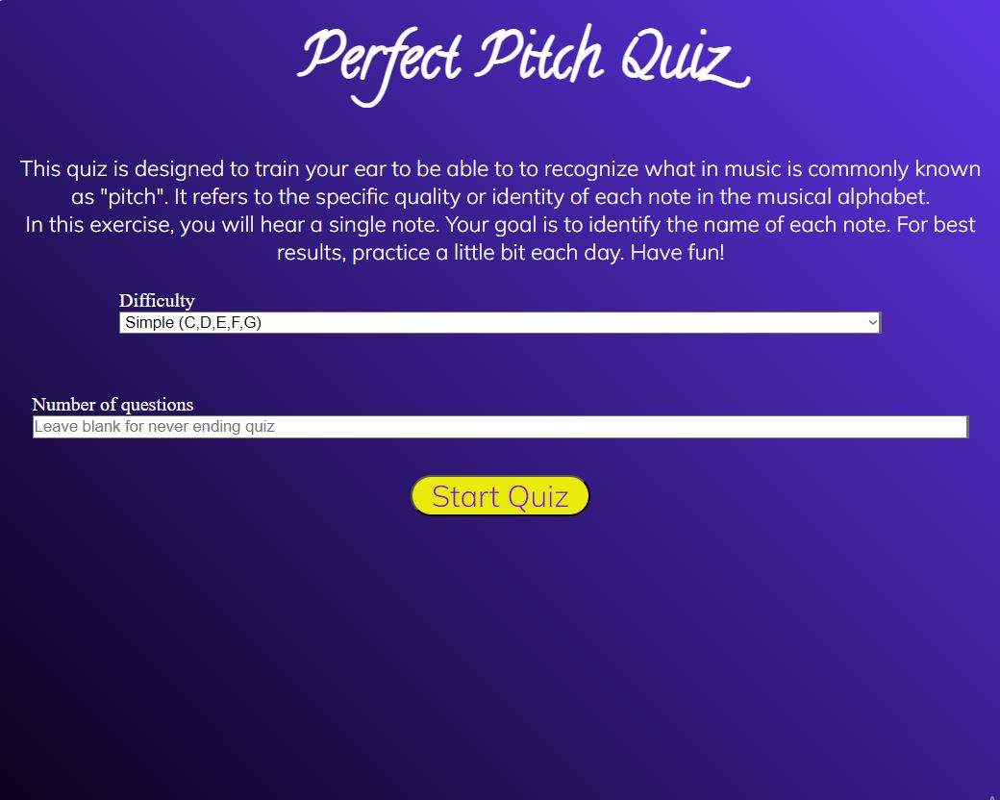
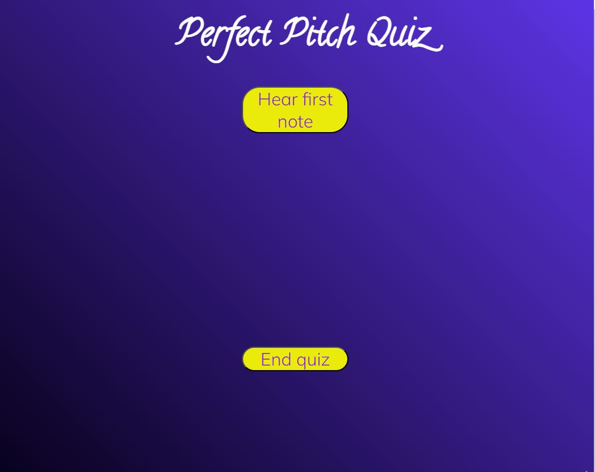
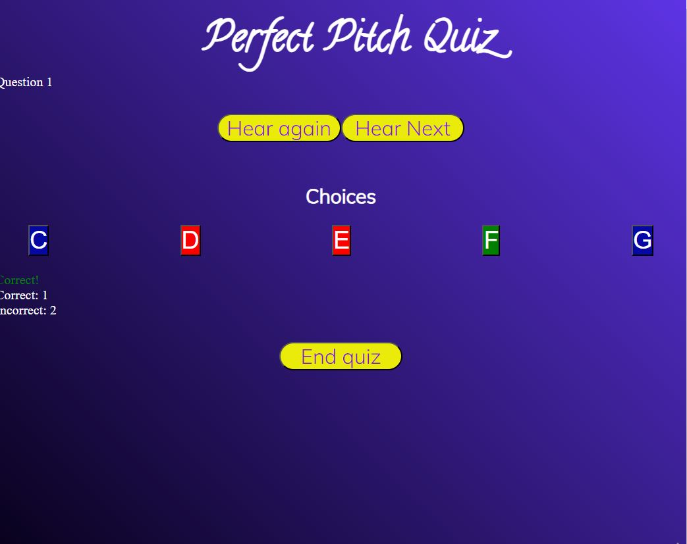
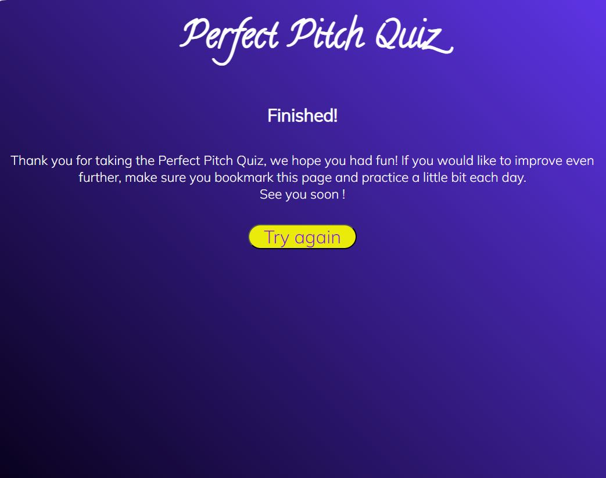
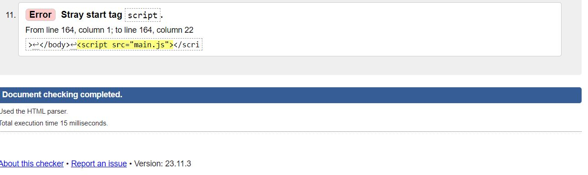
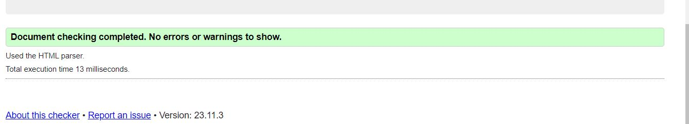
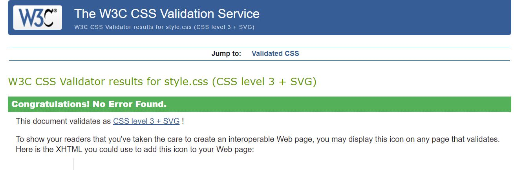
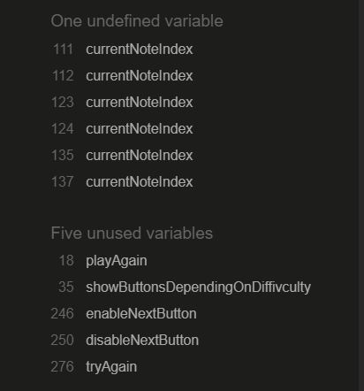

# perfect pitch

Perfect Pitch Quiz is an application that is designed to train musicians and anyone else who is interested in so called "ear training".
The application presents the user with as question in form of a note. The user then has to then make a choice out of the possible options.
If the answer is right, the button turns green, if it is wrong, it turns red.
There is a Next button to prommpt the user to the next questions, and there is a counter which counts the correct and incorrect answers.
The user can chooce the number of questions, or je can choose an unlimited number of questions.

## Features

- Homepage: Introduces users to perfect-pitch,There is also a select dropdown for users to select the level of difficulty they want(simple, Advanced and Pro level), they are also able to input the number of Questions they would like to answer in the input field.

- Hear First Note page(page2): Displays two buttons named Hear first note nd end quiz. The hear first note button takes the user to the next page when clicked and enables the user to listen to the first pitch in the level selected by the user while the end quiz button enables the user to end the quiz and start allover.

- Choices page(page3): it features the choices button and enable users to select the correct answer. When a user selects an incorrect choice, the button turns red but turns green if their choice is correct. There are also two other buttons: Hear again button which enables the user to listen to pitch over and over again when clicked and the Hear Next button which enables the user to listen to the next pitch.
It also has an end quiz button enables the user to end the quiz and start allover.

- Finished Page(page4): Displays a Thank you message to the user and a try again button 

## Validator Testing

- HTML: while testing my index.html file through the official <a href="https://validator.w3.org/">W3C validator</a>. it discovered an error on line 164 of my code which was a result of putting the script tag outside the body tag.  
However I have fixed the error and the validator confirmed that I have no errors or warning to show.

- CSS: I tested my style.css file and No errors were found when passing through the official <a href="https://jigsaw.w3.org/css-validator/">(Jigsaw) validator</a>

-javascript: I tested my main.js file through the official <a href="https://jshint.com">(Jshint) Validator</a>  and it detected some unused variables and undefined variables. .
However, I have fixed the errors and it passed through validation without errors.

## Acknowledgement

  Special Thanks to my teacher Christian Moller who put me through some of the logics

## Credits

- Audio files: <a href="https://freesound.org/">Downloaded from Freesound.org from the user: "pinkyfinger"</a>  
